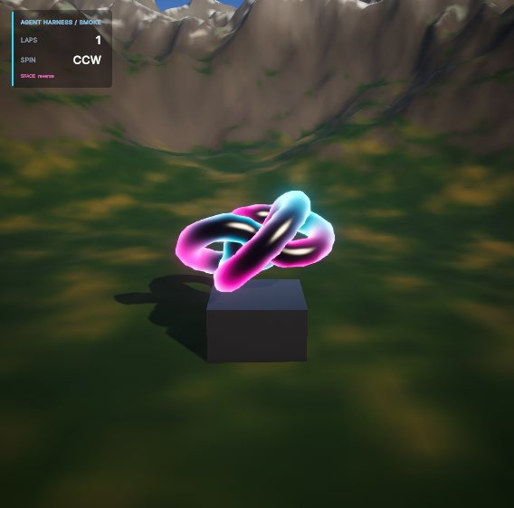

# unitree — AgentHarness

> A Unity 6 (URP) harness that gives coding agents the Three.js-style workflow: everything is text,
> and one command recompiles, rebuilds the scene from code, plays a scripted scenario and returns
> screenshots + console errors + frame stats as JSON.

Claude Code 같은 코딩 에이전트가 **Unity에서도 Three.js로 웹 3D를 만들 때와 같은 완성도**를 내도록 만드는 작업 환경입니다.
게임은 아직 없고, 하네스를 검증하는 스모크 씬(절차적 지형 + 손으로 쓴 HLSL + 라이트 + URP 후처리 + 회전 오브젝트 + UI Toolkit HUD)만 들어 있습니다.
씬 파일도 에셋도 커밋돼 있지 않습니다 — 전부 코드에서 생성됩니다.

| 오프스크린 캡처 (`harness_capture`) | Game 뷰 캡처 (UI 포함) |
|---|---|
|  |  |
|  | 위 이미지는 모두 루프가 자동으로 찍은 샷입니다. |

## 왜

에이전트가 Three.js에서 잘하는 건 모델이 3D를 잘해서가 아니라 환경 덕분입니다. Unity에는 그 환경이 기본으로 없어서, 하나씩 복원했습니다.

| Three.js 환경의 성질 | 이 하네스의 복원 방법 |
|---|---|
| 1. 모든 게 텍스트 | 씬은 `IBuildStep` 빌더 코드가 생성(YAML 직접 수정 금지). HLSL `.shader`, UI Toolkit UXML/USS, 머티리얼·Volume·라이팅도 코드 |
| 2. 초 단위 루프 | Domain Reload off, 모듈별 asmdef, 빌드 캐시, 에디터 없는 컴파일 체크 |
| 3. 눈으로 검증 | 캡처 PNG + 이미지 통계, 컴파일/런타임/셰이더 에러(file·line·module), FPS·batches·tris를 JSON으로 |
| 4. 에셋 없이 완성도 | 절차적 메시/노이즈/텍스처 베이크, 코드로 만든 URP 후처리, 스카이 반사 베이크 |
| 5. 병렬 작업 | `GameRoot.Register(IGameModule)` + `EventBus`, 모듈 폴더 격리, 에디터 조작 뮤텍스 |

## 루프 한 방

```powershell
powershell -ExecutionPolicy Bypass -File tools/loop.ps1
```

recompile → (C# 컴파일 에러면 즉시 중단) → lint → 씬 빌드 → 셰이더 검사 → 플레이 모드 시나리오(입력 재생 + 3컷) →
콘솔·통계 수집 → `HarnessOut/latest/report.json`.

```jsonc
{ "ok": true, "stage": "done",
  "compileErrors": [], "runtimeErrors": [],
  "fps": { "avg": 145.7, "min": 87.3, "p95ms": 9.08 },
  "shots": ["…/HarnessOut/latest/shot0_closeup.png", "…/shot1_horizon.png", "…/shot2_overview.png"],
  "play": { "events": [{ "name": "SpinDirectionChanged", "count": 1 }, { "name": "SpinnerLap", "count": 2 }] },
  "render": { "batches": 45.8, "setPassCalls": 42.7, "triangles": 594544 },
  "durationSec": 3.6 }
```

실패하면 `stage`(compile / build / shader / play / runtime / lint / shots)와 함께 `{"file","line","msg","module"}`가 나옵니다.

| 상황 (측정) | 한 바퀴 |
|---|---|
| 코드 변경 없음 | ~3.5 s |
| 셰이더만 수정 | ~4 s |
| 모듈 C# 1줄 수정 | ~9 s (Unity 컴파일 + 도메인 리로드 ~4 s 포함) |
| C# 컴파일 에러 보고 | ~1 s |

## 요구 사항

- Windows 10/11 — 도구 스크립트는 Windows PowerShell 5.1 기준
- Unity **6000.3.11f1** (Unity 6.3 LTS) + URP (프로젝트에 포함)
- Unity CLI (`unity`, beta): `$env:UNITY_CLI_CHANNEL='beta'; irm https://public-cdn.cloud.unity3d.com/hub/prod/cli/install.ps1 | iex`
- 선택: Visual Studio 2022 MSBuild (`compile-check.ps1`의 msbuild 백엔드). `csc` 백엔드는 Unity 설치에 포함된 Roslyn만 쓴다.
- **짧은 경로에 클론할 것 (프로젝트 경로 60자 이하 권장).** Unity 패키지 내부 경로가 길어서(Library 아래 최장 200자 이상) 긴 경로에 두면
  Windows 260자 경로 제한에 걸려 Unity 자체가 패키지 파일을 못 읽는다. 확인: 49자·57자 경로 정상, 149자 경로에서 임포트 에러와 플레이 실패.

## 빠른 시작

```powershell
git clone https://github.com/geuneda/unitree C:\dev\unitree
unity open C:\dev\unitree\AgentHarness          # 첫 임포트는 몇 분. `unity status`가 ready 가 될 때까지 대기
cd C:\dev\unitree\AgentHarness
powershell -ExecutionPolicy Bypass -File tools/uc.ps1 harness_setup   # 1회: 사용자별 설정(Debug 코드 최적화 등)
powershell -ExecutionPolicy Bypass -File tools/loop.ps1               # 씬이 없으면 여기서 코드로 생성된다
```

개별 커맨드: `tools/uc.ps1 <command> '<JSON>'` (예: `tools/uc.ps1 harness_capture '{"preset":"all"}'`)
또는 `unity command harness_capture --preset all --format json`.

에디터 없이 컴파일만 검사(병렬 에이전트용):

```powershell
powershell -ExecutionPolicy Bypass -File tools/compile-check.ps1 -Module Smoke -Backend csc
```

## 구조

```
AgentHarness/
  CLAUDE.md                 에이전트용 사용법·규칙 (먼저 읽을 것)
  docs/ROADMAP.md           아직 남은 격차 (성질 1~5별) + 검증 매트릭스
  Assets/Harness/Runtime/   GameRoot · IGameModule · EventBus · HarnessProbe · ShotPreset · ScriptedInput · ScenarioRunner
  Assets/Harness/Runtime/Procedural/   MeshBuilder · Noise · TextureBaker · PMath
  Assets/Harness/Editor/    harness_* 에디터 커맨드, BuildContext / IBuildStep
  Assets/Game/<Module>/     모듈 런타임 코드 (+ Shaders/, UI/), Builders/ 에 씬 빌드 스텝
  tools/                    loop.ps1 · uc.ps1 · compile-check.ps1 · scenarios/*.json
```

## 에이전트와 함께 쓰기

`AgentHarness/CLAUDE.md`에 루프 사용법, report.json 해석, 규칙(YAML 직접 수정 금지, 텍스트 우선 형태, 모듈 폴더 밖 수정 금지,
에디터 조작은 순서대로), 모듈·빌더 템플릿, 겪은 함정이 정리돼 있습니다. 하네스 자체를 개선할 때는 `docs/ROADMAP.md`에서 항목을 고르세요.
가장 큰 남은 과제는 병렬 에이전트가 작업 트리를 공유해야 해서, 한 에이전트의 컴파일 에러가 모두의 루프를 막는다는 점입니다(G5-2).

## 라이선스

[MIT](LICENSE). Unity 에디터·패키지와 URP 템플릿 설정 에셋은 각자의 Unity 라이선스를 따릅니다.
