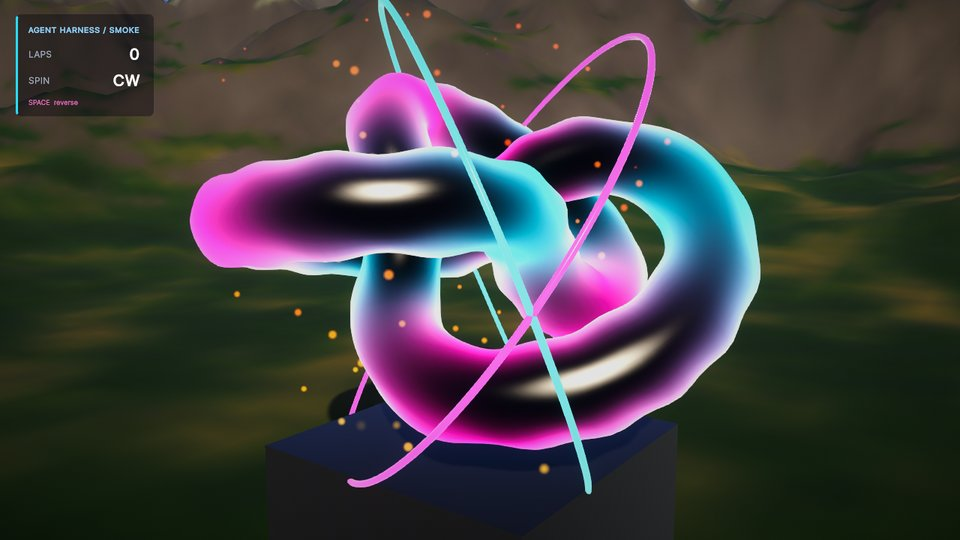
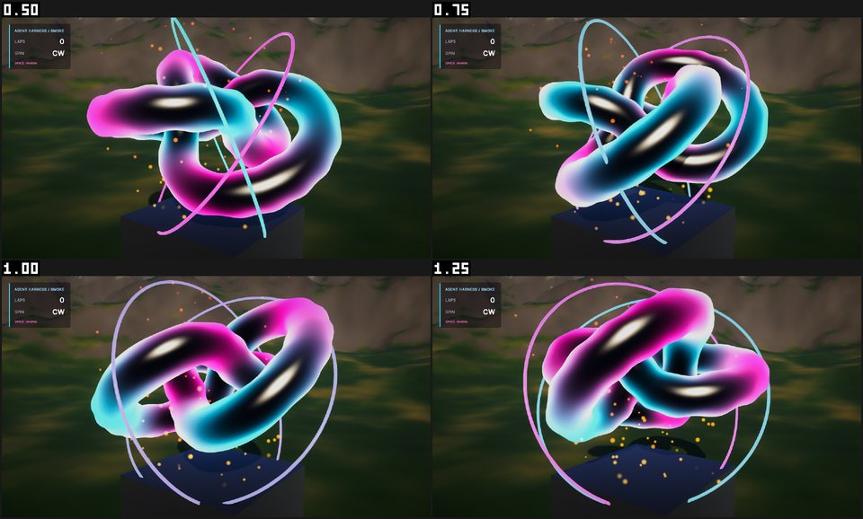
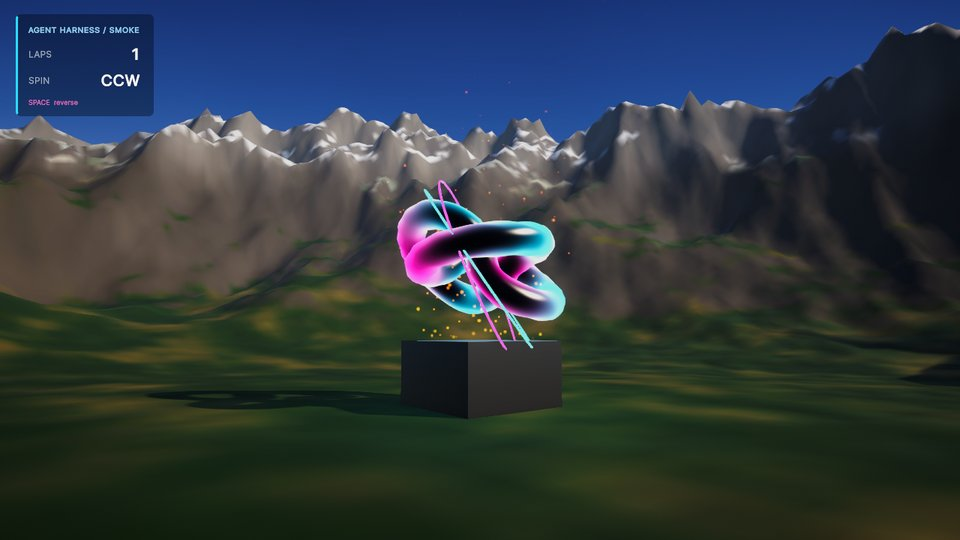
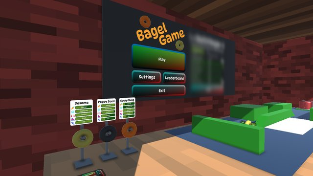
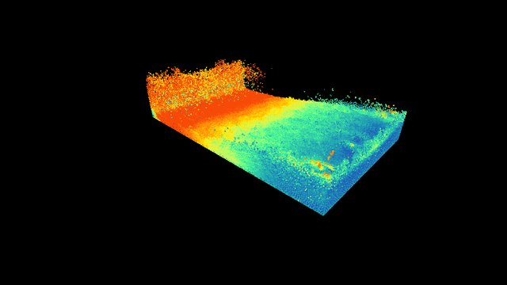
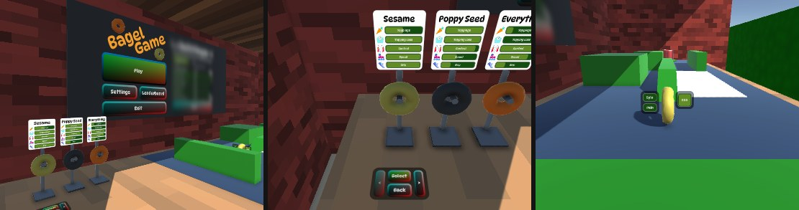

# unitree — AgentHarness

> A Unity 6 (URP) harness that gives coding agents the Three.js-style workflow: everything is text,
> and one command recompiles, rebuilds the scene from code, plays a scripted scenario and returns
> screenshots + console errors + frame stats as JSON.

Claude Code 같은 코딩 에이전트가 **Unity에서도 Three.js로 웹 3D를 만들 때와 같은 완성도**를 내도록 만드는 작업 환경입니다.
하네스는 UPM 패키지(`com.geuneda.agentharness`)이고, **이미 있는 Unity 프로젝트에 설치 스크립트 한 번으로 붙였다 뗄 수 있습니다**(아래 "기존 프로젝트에 붙이기").
이 저장소의 `AgentHarness/`는 그 패키지를 쓰는 샘플 프로젝트로, 하네스를 검증하는 스모크 씬(절차적 지형 + 손으로 쓴 HLSL + 라이트 + URP 후처리 +
회전 오브젝트 + 코드로 만든 파티클·애니메이션 + UI Toolkit HUD)만 들어 있습니다. 씬 파일도 에셋도 커밋돼 있지 않습니다 — 전부 코드에서 생성됩니다.

| 루프가 찍은 샷 (카메라 + HUD 합성) | 연속 캡처 시트 (코드로만 만든 링 애니메이션·불씨 파티클) |
|---|---|
|  |  |
|  | 위 이미지는 모두 루프가 자동으로 찍은 샷입니다. |

## 왜

에이전트가 Three.js에서 잘하는 건 모델이 3D를 잘해서가 아니라 환경 덕분입니다. Unity에는 그 환경이 기본으로 없어서, 하나씩 복원했습니다.

| Three.js 환경의 성질 | 이 하네스의 복원 방법 |
|---|---|
| 1. 모든 게 텍스트 | 씬은 `IBuildStep` 빌더 코드가 생성(YAML 직접 수정 금지), URP·Renderer 에셋과 품질 레벨별 파이프라인은 `ISettingsStep` 코드가 생성. HLSL `.shader`, UI Toolkit UXML/USS, 머티리얼·Volume·라이팅·파티클·애니메이션 클립도 코드 |
| 2. 초 단위 루프 | Domain Reload off, 모듈별 asmdef, 빌드 캐시, 에디터 없는 컴파일 체크, `[CodeReload]` 메서드 본문만 고쳤으면 컴파일 없이 바꿔 넣는 핫 루프(`loop.ps1 -Hot`) |
| 3. 눈으로 검증 | 캡처 PNG(화면의 카메라 스택·미니맵 + 스크린 공간 UI) + 이미지 통계, 연속 캡처 시트, 기준 이미지와의 diff 점수·바뀐 곳 PNG, 컴파일/런타임/셰이더 에러(file·line·module), FPS·batches·tris를 JSON으로 |
| 4. 에셋 없이 완성도 | 절차적 메시/노이즈/텍스처 베이크, 코드로 만든 URP 후처리, 라이팅 베이크 없는 스카이 반사·앰비언트, 키워드를 알아서 맞추는 `LitMaterial`, 설정 한 벌로 만드는 결정적 파티클(`ctx.Particles`), 키를 코드로 쓰는 애니메이션 클립을 Playables로 재생(`ctx.AnimationClip` + `ClipPlayer`, 틀린 경로·속성은 빌드 경고) |
| 5. 병렬 작업 | `GameRoot.Register(IGameModule)` + `EventBus`, 모듈 폴더 격리, 에디터 조작 뮤텍스, 에이전트별 worktree + 트랜잭션 submit / land |

## 루프 한 방

```powershell
powershell -ExecutionPolicy Bypass -File tools/loop.ps1
powershell -ExecutionPolicy Bypass -File tools/loop.ps1 -Hot   # [CodeReload] 메서드 본문만 고쳤을 때 (아래)
```

recompile → (C# 컴파일 에러면 즉시 중단) → lint → 씬 빌드 → 셰이더 검사 → 플레이 모드 시나리오(입력 재생 + 3컷) →
콘솔·통계 수집 → `HarnessOut/latest/report.json`.

```jsonc
{ "ok": true, "stage": "done",
  "compileErrors": [], "runtimeErrors": [],
  "fps": { "avg": 151.6, "min": 52.6, "p95ms": 7.99 },
  "shots": ["…/HarnessOut/latest/shot0_closeup.png", "…/shot1_horizon.png", "…/shot2_overview.png"],
  "play": { "events": [{ "name": "ClipEvent:HaloHalfTurn", "count": 1 }, { "name": "SpinDirectionChanged", "count": 1 }, { "name": "SpinnerLap", "count": 2 }] },
  "render": { "batches": 50.9, "setPassCalls": 47.8, "triangles": 609129 },
  "golden": { "version": "6000.3.11f1", "same": 3, "changed": 0, "missing": 0 },
  "durationSec": 3.6 }
```

실패하면 `stage`(compile / build / shader / play / runtime / lint / shots)와 함께 `{"file","line","msg","module"}`가 나옵니다.
샷은 커밋된 기준 이미지(`golden/<Unity 버전>/<시나리오>/`)와 비교됩니다. 같은 머신이면 픽셀까지 같아서, 셰이더 한 줄(스펙큘러 절반)도
`changed` + 바뀐 곳을 칠한 diff PNG로 드러납니다(실패로 치지는 않음). 의도한 변경이면 `loop.ps1 -UpdateGolden`으로 갱신합니다.

| 상황 (측정) | 한 바퀴 |
|---|---|
| 코드 변경 없음 | ~3.6 s |
| 셰이더만 수정 | ~3.8 s |
| 모듈 C# 1줄 수정 | ~9.0 s (Unity 컴파일 ~0.4 s + 도메인 리로드 ~2.5 s + 리로드 뒤 에디터 자체 작업 ~0.9 s 포함) |
| 같은 수정이 `[CodeReload] Tick` 본문 안이면 `loop.ps1 -Hot` | **~3.3 s** |
| C# 컴파일 에러 보고 | ~1.1 s |

`-Hot`은 마지막 전체 루프가 컴파일한 소스와 Roslyn 토큰으로 비교해, 바뀐 것이 `[CodeReload]` 메서드 본문뿐이면 Unity Pipeline 패키지의 인터프리터로
그 본문만 바꿔 넣고(컴파일·도메인 리로드·씬 빌드 없음) 같은 시나리오를 처음부터 돕니다 — 이벤트 수·기준 이미지 비교가 전체 루프와 그대로 맞고, 같은 코드면
픽셀까지 같습니다. 필드·시그니처·새 파일·에셋이 바뀌었거나 인터프리터가 못 돌리는 구문이거나 바꾼 본문이 예외를 던지면 알아서 전체 루프를 돌고
이유(`hot.fallback`, 필요하면 그 줄)를 남깁니다.

## 기존 프로젝트에 붙이기

```powershell
git clone https://github.com/geuneda/unitree C:\dev\unitree
$install = 'C:\dev\unitree\AgentHarness\Packages\com.geuneda.agentharness\Tools~\install.ps1'
powershell -ExecutionPolicy Bypass -File $install -Project C:\dev\MyGame -WhatIf     # 바꿀 목록만 본다
powershell -ExecutionPolicy Bypass -File $install -Project C:\dev\MyGame             # Build Settings의 첫 씬을 돈다
#   -Scene Assets/Scenes/Level1.unity   플레이할 씬(Build Settings가 비어 있으면 필수)
#   -Module Gameplay=Assets/Scripts      기존 코드 폴더를 모듈로(에러의 module, worktree submit/land 단위; asmdef 없어도 됨)
#   -InputShim                           구 Input Manager(Input.GetKey) 게임: 시나리오 입력을 받는 드롭인 Input(HarnessInput.cs)
#   -KnownErrors '^\[SDK\] ...'          프로젝트가 원래 내는 에러(정규식)는 루프를 막지 않고 knownErrors로
cd C:\dev\MyGame
powershell -ExecutionPolicy Bypass -File tools/open.ps1     # 처음이면 패키지를 받으려고 배치 모드로 한 번 임포트한 뒤 연다
powershell -ExecutionPolicy Bypass -File tools/loop.ps1     # 기존 씬으로 재컴파일 → 플레이 → 캡처·콘솔·FPS
powershell -ExecutionPolicy Bypass -File tools/quit.ps1
powershell -ExecutionPolicy Bypass -File tools/uninstall.ps1   # 설치가 더한 것만 지워 git status를 원래대로
```

- **바꾸는 것**: `Packages/manifest.json`에 패키지 한 줄(기본은 이 저장소의 git URL, `-Source local|embed`도 가능)과 새 파일
  (`tools/*.ps1` 진입점, `tools/scenarios/default.json`, 에이전트용 안내 `tools/AgentHarness.md`, 설정 `ProjectSettings/AgentHarness.json`,
  `CLAUDE.md`/`AGENTS.md`가 없을 때만 `CLAUDE.md`)뿐입니다. `Assets/`와 `ProjectSettings/*.asset`은 건드리지 않고, 어떤 파일도 지우지 않습니다.
  Unity가 새 의존성을 풀면서 `Packages/packages-lock.json`을 갱신합니다(uninstall이 설치 전 내용으로 되돌림).
- **프로젝트 설정은 그대로**: `harness_setup`은 권장 사항(예: Domain Reload 끄기)만 보여 주고, `{"apply":"domainReload"}`처럼 명시할 때만 바꿉니다.
  Domain Reload가 켜진 프로젝트에서도 루프가 돌고, 늘어난 시간은 `timings.playEnterSec`으로 보입니다(핫 루프 `-Hot`만은 Domain Reload를 꺼야 합니다).
- **출시 빌드에는 하네스가 없습니다**: 하네스 런타임은 `UNITY_EDITOR || DEVELOPMENT_BUILD`에서만 컴파일되고, 하네스 때문에 들어온
  `com.unity.pipeline`의 런타임 DLL·Newtonsoft.Json(·설치가 추가한 Input System)은 출시 빌드에서 빠집니다. 개발 빌드에는 들어갑니다.
- URP·Built-in 둘 다, Input System 유무와 상관없이 컴파일됩니다. 입력 재생: Input System 게임은 그대로, 구 Input Manager(`Input.GetKey`) 게임은
  에디터가 OS 입력을 직접 읽어서 코드로 누를 수 없으므로 `Input.` → `HarnessInput.`(같은 멤버 이름의 드롭인, `-InputShim`)으로 받습니다.
  시나리오가 도는 동안 게임은 시나리오 입력만 받습니다(실제 키보드·마우스·게임패드는 꺼지고 끝나면 다시 켜짐) — 루프 중에 사람이 다른 창에서
  타이핑해도 결과가 같습니다.
- **부트 → 메뉴 → 레벨**: 시나리오가 `waitTarget`(버튼이 보일 때까지)·`waitScene`(씬이 로드될 때까지)으로 시계를 멈추고, `click`이 이름으로 찾은
  UI(uGUI, UI Toolkit — 월드 공간 패널 포함)나 씬 오브젝트를 누릅니다. 캡처는 카메라 이름·포즈를 시나리오나 설정(`shots`)에 적어 기존 씬을 건드리지 않습니다.
  아래는 BagelGame에 붙인 뒤 시나리오 한 번(`waitTarget play-button` → `click` → `waitTarget select-button` → `click`)이 찍은 Game 뷰 3컷입니다.
- 검증: 하네스를 모르는 공개 프로젝트 2개 — [BagelGame](https://github.com/Unity-Technologies/BagelGame)(URP, Unity 6.3, 기존 씬 `Main.unity`)과
  [SebLague/Fluid-Sim](https://github.com/SebLague/Fluid-Sim)(Built-in, 2022.3 → 6.0, 컴퓨트 셰이더). 설치 → 기존 씬으로 루프 3회 녹색 →
  출시 빌드의 `Managed/` DLL 목록이 하네스 없는 대조 빌드와 같음 → 제거 후 `git status` 깨끗. 절차 전체는 `tools/attach-test.ps1` 한 번(30–57 s).
  그리고 비공개 사내 모바일 게임 1개(URP, Addressables, 씬 22개, asmdef 35개, C# 4,400개, 부트 → 로그인 → 타이틀 → 로비): 설치 → 루프 3회 녹색 →
  제거 후 `git status` 깨끗(로비까지 도는 시나리오로 135 s). Fluid-Sim은 `HarnessInput`으로 구 Input Manager 입력(스페이스 일시정지, 마우스 궤도)까지.

| BagelGame (URP) 메인 메뉴 | Fluid-Sim (Built-in) 입자 시뮬레이션 |
|---|---|
|  |  |



## 요구 사항

- Windows 10/11 — 도구 스크립트는 Windows PowerShell 5.1 기준
- Unity **6.0 LTS 이상** + URP. 샘플 프로젝트는 **6000.3.11f1**(Unity 6.3 LTS)로 고정돼 있고, 새 클론에서 6000.0.84f1·6000.3.11f1·6000.6.3f1 모두
  검증 매트릭스가 전부 녹색입니다(6.6의 검은 조명은 W4에서 고침, ROADMAP P-4). 다른 설치 버전으로 열 때는 `tools/open.ps1 -UnityVersion <버전>`.
- Unity CLI (`unity`, beta): `$env:UNITY_CLI_CHANNEL='beta'; irm https://public-cdn.cloud.unity3d.com/hub/prod/cli/install.ps1 | iex`
- 하네스가 에디터에 붙는 통로는 Unity의 실험 패키지 `com.unity.pipeline`(0.8.0-exp.1)이다. 하네스 패키지의 의존성으로 함께 설치된다.
- 선택: Visual Studio 2022 MSBuild (`compile-check.ps1`의 msbuild 백엔드). 기본인 `csc` 백엔드는 Unity 설치에 포함된 Roslyn만 쓴다.
- **짧은 경로에 클론할 것 (프로젝트 경로 60자 이하 권장).** Unity 패키지 내부 경로가 길어서(Library 아래 최장 200자 이상) 긴 경로에 두면
  Windows 260자 경로 제한에 걸려 Unity 자체가 패키지 파일을 못 읽는다. 확인: 49자·57자 경로 정상, 149자 경로에서 임포트 에러와 플레이 실패.

## 빠른 시작

```powershell
git clone https://github.com/geuneda/unitree C:\dev\unitree
cd C:\dev\unitree\AgentHarness
powershell -ExecutionPolicy Bypass -File tools/open.ps1               # 에디터를 열고 쓸 수 있을 때까지 대기 (첫 임포트 ~1.5분)
powershell -ExecutionPolicy Bypass -File tools/uc.ps1 harness_setup   # 1회: 사용자별 설정(Debug 코드 최적화 등)
powershell -ExecutionPolicy Bypass -File tools/loop.ps1               # 씬이 없으면 여기서 코드로 생성된다
powershell -ExecutionPolicy Bypass -File tools/quit.ps1               # 끝낼 때: 정상 종료
```

`open.ps1`은 에디터 로그를 프로젝트의 `Logs/Editor.log`에 따로 쓰게 합니다. `unity open`이나 Hub로 열면 모든 에디터가
사용자 전역 `Editor.log` 하나를 서로 덮어써서, 에디터를 둘 이상 띄우면 로그가 뒤섞입니다.

위 과정 전체(클론 → 열기 → 설정 → 루프 3회 → 종료 → 삭제)를 `tools/fresh-clone-test.ps1` 하나로 검증할 수 있습니다(이 머신에서 ~110 s).
하네스 자체의 검증 매트릭스(에러 주입·핫 루프·동시 루프·worktree submit/land)는 `tools/selftest.ps1`이 한 번에 돌리고(~5분),
`fresh-clone-test.ps1 -UnityVersion <버전> -SelfTest`는 그것을 다른 Unity 버전의 새 클론에서 돌립니다.

개별 커맨드: `tools/uc.ps1 <command> '<JSON>'` (예: `tools/uc.ps1 harness_capture '{"preset":"all"}'`)
또는 `unity command harness_capture --preset all --format json`.

에디터 없이 컴파일만 검사(에디터 내장 Roslyn, 모듈당 ~0.5 s):

```powershell
powershell -ExecutionPolicy Bypass -File tools/compile-check.ps1 -Module Smoke
```

## 여러 에이전트가 동시에 작업할 때 (worktree + submit + land)

### 문제

Unity 에디터는 프로젝트 폴더 하나(이하 **에디터 트리**)에만 붙어 있고, 어셈블리 하나라도 컴파일에 실패하면 도메인 리로드를 하지 않습니다.
그래서 여러 에이전트가 에디터 트리를 직접 고치면, 한 명이 쓰다 만 코드 때문에 **모두의 루프가 `stage=compile`로 멈춥니다.**
모듈별 asmdef는 다시 컴파일하는 범위만 줄여 줄 뿐 이 문제를 막지 못합니다.

### 사용법

```powershell
git worktree add ..\wt-foo -b agent/foo          # 에디터가 연 체크아웃에서, 에이전트당 1회 (Library/ 없음 → 임포트 불필요)
cd ..\wt-foo\AgentHarness                       # 이후 편집·명령은 모두 여기서. Assets/Game/Foo/ 만 고친다
powershell -ExecutionPolicy Bypass -File tools/compile-check.ps1 -Module Foo   # 에디터 없이 ~0.5 s, 동시 실행 OK
powershell -ExecutionPolicy Bypass -File tools/submit.ps1 -Module Foo         # 에디터 트리에서 루프 (트랜잭션)
git add -A; git commit -m "Foo: ..."            # submit이 되복사한 .meta까지 커밋
powershell -ExecutionPolicy Bypass -File tools/land.ps1                       # 이 브랜치를 에디터 트리 브랜치에 병합 (트랜잭션)
```

결과는 `loop.ps1`과 같은 report.json에 `submit` / `land` 필드가 붙어 worktree의 `HarnessOut/submit/`, `HarnessOut/land/`에 나옵니다.
종료코드 0 = 녹색이고 반영(병합)됨.

### 작동 원리

에이전트는 코드를 자기 worktree에만 씁니다. 에디터 트리에는 `submit.ps1`만 파일을 넣고, 넣은 결과가 빨가면 스스로 되돌립니다.
그래서 에디터 트리는 항상 "마지막으로 녹색이었던 상태"로 남고, 다른 에이전트의 루프는 그 상태 위에서 돕니다.

| 단계 | 어디서 | 하는 일 | 실패하면 |
|---|---|---|---|
| ① 사전 검사 | worktree, 락 없음 | worktree 소스를 에디터가 쓰는 컴파일러 설정(`Library/Bee/*.rsp`)과 DLL로 컴파일한다. 참조하는 `Game.Contracts`도 같이 컴파일해 연결하고, 에디터가 아직 모르는 새 모듈은 응답 파일을 합성한다 | `stage=compile`, 에디터 트리는 손대지 않음 (~1 s) |
| ② 동기화 | 에디터 락 안 | 덮어쓰거나 지울 파일을 백업하고 저널(`Library/Harness/submit/pending.json`)을 쓴 뒤, `Assets/Game/<Module>/`를 그대로 미러링한다. `Contracts/`는 **새 파일만** 추가 | 기존 계약 파일을 바꿨으면 `stage=submit`으로 거부 |
| ③ 루프 | 에디터 트리 | `loop.ps1`과 같은 루프 (컴파일 → 씬 빌드 → 플레이 → 콘솔·통계) | — |
| ④ 판정 | 에디터 락 안 | 녹색이면 유지하고, Unity가 새로 만든 `.meta`를 worktree로 되복사한다(GUID를 커밋하도록) | 백업을 복원하고 다시 컴파일 → 에디터 트리는 submit 전 상태 |

- **어느 에디터에 붙는가**: `Library/`가 없는 체크아웃은 `git worktree list`의 메인 worktree에서 같은 하위 경로를 에디터 트리로 씁니다
  (복사본이면 `AGENTHARNESS_EDITOR_ROOT`). 락과 에디터 HTTP 연결은 항상 에디터 트리 기준이라, 어느 worktree에서 실행해도 같은 줄에 섭니다.
- **되돌리는 기준**: 컴파일 실패는 항상 되돌립니다. 런타임·셰이더·lint·빈 화면 실패도 기본은 되돌리고, `-KeepOnFail`을 주면 남깁니다
  (에디터 트리가 이미 남의 모듈 때문에 빨간 경우용; `submit.errorModules`로 판단).
- **도중에 죽어도 안전**: submit이 타임아웃·kill로 죽으면 저널이 남습니다. 다음에 락을 잡는 `loop`/`uc`/`submit`이 그 저널로
  자동으로 되돌리고 report에 `recoveredSubmit`을 남깁니다.
- **실수 방지**: worktree에서 `loop.ps1`을 돌리면 거부됩니다(`stage=submit`). 에디터가 컴파일하는 건 worktree가 아니라 에디터 트리이기 때문입니다.
- **한 모듈 = 한 에이전트**: submit은 모듈별로 마지막에 반영한 worktree를 기록합니다(`Library/Harness/submit/owners.json`).
  다른 살아 있는 worktree가 올린, 아직 병합되지 않은 변경이 에디터 트리에 있는 모듈은 `stage=submit`으로 거부합니다(`-Takeover`로 인수).
  에디터 트리 브랜치에 그 모듈을 건드린 커밋이 있는데 worktree에 없으면(미러링하면 병합된 작업을 되돌리게 되므로) `git merge master`를 먼저 하라고 거부합니다.

### 병합 (land)

submit한 파일은 에디터 트리에 미커밋 사본으로 남아 있어서, 그냥 `git merge agent/foo`를 하면 git이 "would be overwritten"으로 거부합니다.
`land.ps1`은 에디터 락을 잡고 이 과정을 트랜잭션으로 처리합니다.

| 단계 | 하는 일 | 실패하면 |
|---|---|---|
| ① 사전 검사 (락 없음) | 브랜치를 체크아웃한 worktree에 미커밋 파일이 없는지(커밋된 것만 병합되므로) | `stage=land`, 아무것도 건드리지 않음 |
| ② 사전 검사 (락 안) | `git merge-tree`로 객체 저장소 안에서만 병합해 충돌 확인. 브랜치가 `Assets/`에 추가하는 파일·폴더의 `.meta`가 커밋돼 있는지. 건드리는 모듈에 다른 worktree의 미병합 submit이 없는지(`-Takeover`). 병합이 덮어쓸 미커밋 변경이 이 브랜치의 submit 사본(또는 같은 내용)뿐인지 | `stage=land` + `land.conflicts` / `missingMeta` / `owner` / `foreign`, 아무것도 건드리지 않음 (~1–2 s) |
| ③ 병합 | 저널(`Library/Harness/land/pending.json`)을 쓰고, 병합이 건드리는 경로의 미커밋 사본만 `git stash`(모든 worktree가 공유하는 stash 목록에서 바로 빼서 전용 ref에 보관) → `git merge` | 저널로 되돌림 |
| ④ 루프 + 판정 | 에디터 트리에서 평소 루프. 녹색이면 병합 유지, stash 버림, 모듈 소유 해제 | `git reset --keep`으로 병합 전 커밋으로(병합한 경로만; 다른 미커밋 작업은 그대로) → stash 복원 → 재컴파일 |

도중에 죽어도(타임아웃·kill) 다음에 락을 잡는 `loop`/`uc`/`submit`/`land`가 저널로 되돌리고 report에 `recoveredLand`를 남깁니다.

### 검증 (측정)

| 상황 | 결과 |
|---|---|
| A가 컴파일 에러가 있는 모듈을 submit | 사전 검사에서 0.96 s 만에 거부, 에디터 트리 변화 없음 |
| A가 사전 검사를 건너뛰고 강제 submit, 0.5 s 뒤 B가 새 모듈 + 새 계약 submit | A: `stage=compile`(정확한 file/line) → 되돌림 + 복구 컴파일. B: 락 5.7 s 대기 후 **녹색** |
| 런타임 예외가 나는 코드를 submit | `stage=runtime`(정확한 줄) → 되돌림 |
| 파일 복사 직후 submit 프로세스를 kill | 깨진 코드가 남은 상태에서 다음 `loop.ps1`이 저널로 되돌리고 녹색 |
| submit + 커밋한 브랜치를 land | fast-forward·병합 커밋 모두 **녹색**, 5.2–6.7 s (검사 ~1 s, stash+merge ~0.5 s, 루프 ~4 s). 에디터 트리 `git status` 깨끗 |
| B의 land와 A의 submit을 동시에 | A가 락 4.2 s 대기 후 녹색, B도 녹색 |
| 컴파일 에러가 있는 커밋을 land | `stage=compile`(정확한 줄) → 병합 되돌림. HEAD·`git status`·다른 에이전트의 미병합 모듈 모두 그대로 |
| 병합 직후(루프 중) land 프로세스를 kill | 다음 `loop.ps1`이 `recoveredLand`로 되돌리고 녹색, HEAD·`git status` 그대로 |
| 충돌 / `.meta` 미커밋 / worktree에 미커밋 파일 / 남의 미병합 submit / 에디터 트리 직접 수정 | 각각 0.8–2 s 만에 `stage=land`로 거부, 아무것도 건드리지 않음 |

### 한계

- 루프 자체는 여전히 한 번에 하나씩 돕니다(G5-1).
- `Contracts/`는 여전히 "추가만" 규칙으로 버팁니다(G5-4).
- land는 git 병합이라 브랜치의 중간 커밋(깨진 커밋 포함)도 이력에 그대로 들어갑니다. 최종 결과만 루프로 검증합니다.

## 구조

```
AgentHarness/                              샘플 프로젝트 (하네스 패키지를 임베드해서 씀)
  CLAUDE.md                                에이전트용 사용법·규칙 (먼저 읽을 것)
  docs/ROADMAP.md                          아직 남은 격차 (워크플로우별 작업 순서 + 성질 1~5 + 이식성) + 검증 매트릭스
  Packages/com.geuneda.agentharness/       하네스 = UPM 패키지 (git URL: ...unitree.git?path=/AgentHarness/Packages/com.geuneda.agentharness)
    Runtime/                               GameRoot · IGameModule · EventBus · HarnessConfig · ShotPreset · ScriptedInput · ScenarioInput · ScenarioRunner ·
                                           HarnessCapture(+CaptureCameras · CaptureUi · ContactSheet) · ClipPlayer(Playables 클립 재생) · Procedural/
    Editor/                                harness_* 에디터 커맨드(핫 루프 harness_hot 포함), BuildContext(머티리얼·파티클·애니메이션 헬퍼) / IBuildStep,
                                           SettingsContext / ISettingsStep, 출시 빌드 필터
    Tools~/                                loop · submit · land · uc · compile-check · open · quit · install · uninstall · attach-test ·
                                           fresh-clone-test · selftest (.ps1) + templates/ (Unity는 ~ 폴더를 임포트하지 않는다)
  ProjectSettings/AgentHarness.json        하네스 설정: 모듈 폴더, 플레이할 씬, setup 모드
  golden/<Unity 버전>/<시나리오>/           기준 이미지 (루프 샷과 비교, loop.ps1 -UpdateGolden이 씀)
  Assets/Game/<Module>/                    모듈 런타임 코드 (+ Shaders/, UI/), Builders/ 에 씬 빌드 스텝·렌더 설정 스텝
  tools/*.ps1                              패키지 Tools~의 같은 이름 스크립트를 부르는 얇은 진입점 (모두 같은 파일) · scenarios/*.json
```

## 에이전트와 함께 쓰기

`AgentHarness/CLAUDE.md`에 루프 사용법, report.json 해석, 규칙(YAML 직접 수정 금지, 텍스트 우선 형태, 모듈 폴더 밖 수정 금지,
에디터 조작은 순서대로), 모듈·빌더 템플릿(`[CodeReload] Tick` 포함 — 본문만 고치면 `loop.ps1 -Hot`), 머티리얼·파티클·애니메이션 클립 헬퍼, 겪은 함정이 정리돼 있습니다. 하네스 자체를 개선할 때는 `docs/ROADMAP.md`의 "작업 순서"에서 다음 워크플로우를 고르세요.
병렬 에이전트는 위의 worktree + `submit.ps1` + `land.ps1` 흐름을 씁니다(G5-2, G5-5). 남은 병렬 과제는 루프 직렬화(G5-1)와 `Contracts` 공유 지점(G5-4)입니다.

## 라이선스

[MIT](LICENSE). Unity 에디터·패키지와 URP 템플릿 설정 에셋은 각자의 Unity 라이선스를 따릅니다.
